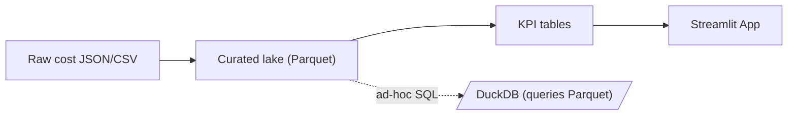

# Cloud-Cost & Usage Observatory

[](https://github.com/MrSanjeeva/cloud-cost-observatory/actions/workflows/ci.yml)
[](LICENSE)
[](https://ccobservatory.streamlit.app/)

**Purpose —** End‑to‑end demo that ingests AWS Cost‑and‑Usage data (or synthetic sample), builds curated Parquet tables, derives daily KPIs, and serves an interactive Streamlit dashboard for cost, idle‑percentage, service breakdown, and anomaly detection.

---

## Features

- **Data ingest** — pull real Cost Explorer JSON _or_ generate synthetic data for offline demos.
- **Transform & store** — incremental Parquet tables managed by DuckDB/Polars.
- **KPI suite** — cost-per-team, idle-compute %, 30-day burn forecast, anomaly score.
- **Cost by service** — stacked‑area view highlights which AWS services drive spend.
- **Anomaly detection** — red markers flag days ±2 σ from the 30‑day mean.
- **Dashboard** — Streamlit app with date‑range slider, forecast card, idle‑% scatter, and live refresh.
- **CI / Tests** — GitHub Actions runs lint + unit tests on every push.

---

## Quick Start

```bash
# clone & enter
git clone https://github.com/MrSanjeeva/cloud-cost-observatory.git
cd cloud-cost-observatory

# set up env
python -m venv .venv && source .venv/bin/activate  # Windows: .venv\Scripts\Activate.ps1
pip install -r requirements.txt

# ingest sample 90-day dataset
python fetch_or_generate.py --sample 90days

# build KPI tables
python pipeline_polars.py

# launch dashboard
streamlit run app/streamlit_app.py
```

---

## Live Demo

**<https://ccobservatory.streamlit.app/>**

## Want real AWS data instead of the synthetic sample?

See **[docs/REAL_AWS_DATA.md](docs/REAL_AWS_DATA.md)** for step‑by‑step credentials setup.

## Project Status

**Status —** ✅ Completed

## Architecture

_Data lineage from raw CSV to dashboard_



## License

This project is licensed under the MIT License
