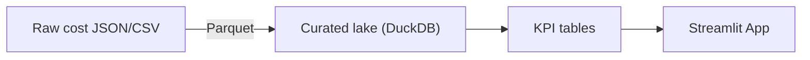

# Cloud-Cost & Usage Observatory

[](https://github.com/MrSanjeeva/cloud-cost-observatory/actions/workflows/ci.yml)
[](LICENSE)

**Purpose —** End-to-end demo that ingests (or generates) cloud Cost-and-Usage data, builds KPI tables, and serves insights through a public Streamlit dashboard.

---

## Features

- **Data ingest** — pull real Cost Explorer JSON _or_ generate synthetic data for offline demos.
- **Transform & store** — incremental Parquet tables managed by DuckDB/Polars.
- **KPI suite** — cost-per-team, idle-compute %, 30-day burn forecast, anomaly score.
- **Dashboard** — Streamlit app with interactive filters and Slack-style alerts.
- **CI / Tests** — GitHub Actions runs lint + unit tests on every push.

---

## Quick Start

```bash
# clone & enter
git clone https://github.com/MrSanjeeva/cloud-cost-observatory.git
cd cloud-cost-observatory

# set up env
python -m venv .venv && source .venv/bin/activate  # Windows: .venv\Scripts\Activate.ps1
pip install -r requirements.txt

# ingest sample 90-day dataset
python fetch_or_generate.py --sample 90days

# build KPI tables
python pipeline_polars.py

# launch dashboard
streamlit run app/streamlit_app.py
```

---

### Want real AWS data instead of the synthetic sample?
See **[docs/REAL_AWS_DATA.md](docs/REAL_AWS_DATA.md)** for step‑by‑step credentials setup.
---

## Project Status

MVP in progress

## Architecture



## License

This project is licensed under the MIT License
